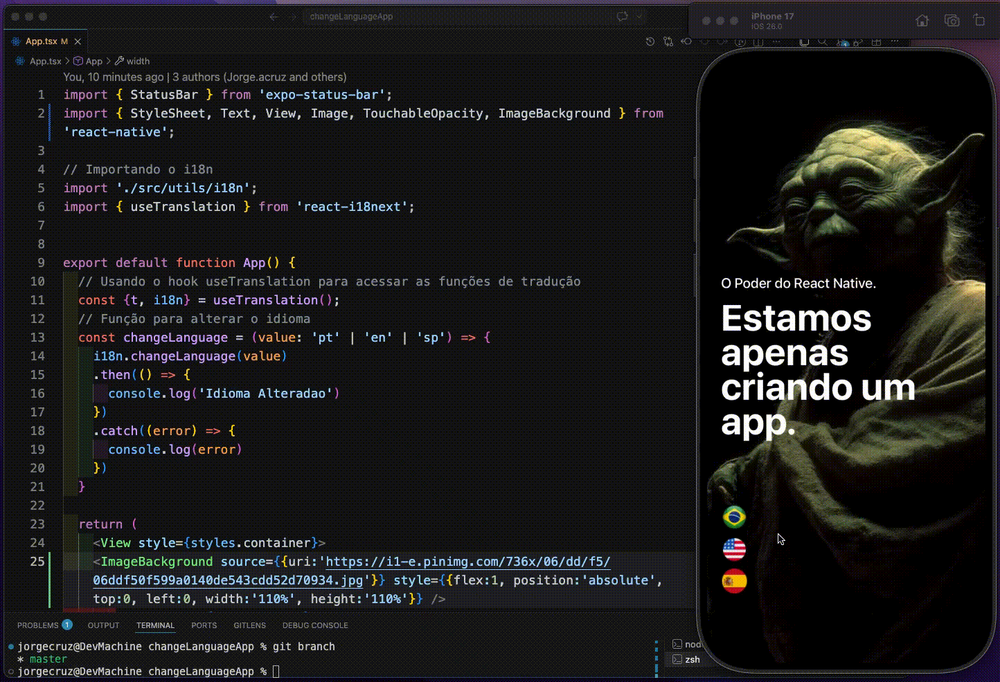

<p></p>
# 🌍 i18n no React Native

Implementar **i18n (internationalization)** em aplicações React Native permite criar apps preparados para múltiplos idiomas e regiões, melhorando a experiência do usuário e tornando o projeto mais escalável.

---

## 🚀 Principais possibilidades

- Tradução de textos
- Troca automática de idioma
- Seleção manual de idioma
- Formatação regional
  - moedas
  - datas
  - horários
- Estrutura escalável para múltiplos idiomas

### Bibliotecas recomendadas

- i18next
- react-i18next
- react-native-localize

---

# 📦 Instalação

```bash
npm install i18next react-i18next react-native-localize
```

---

# 📁 Estrutura do projeto

```bash
src/
 ├── locales/
 │    ├── pt.json
 │    └── en.json
 └── i18n.js
```

---

# 🌐 Arquivos de tradução

## pt.json

```json
{
  "welcome": "Bem-vindo ao aplicativo"
}
```

## en.json

```json
{
  "welcome": "Welcome to the app"
}
```

---

# ⚙️ Configuração do i18n

## src/i18n.js

```javascript
import i18n from 'i18next';
import { initReactI18next } from 'react-i18next';

import pt from './locales/pt.json';
import en from './locales/en.json';

i18n
  .use(initReactI18next)
  .init({
    lng: 'pt',
    fallbackLng: 'en',

    resources: {
      pt: {
        translation: pt,
      },
      en: {
        translation: en,
      },
    },

    interpolation: {
      escapeValue: false,
    },
  });

export default i18n;
```

---

# 📲 Importando no App

```javascript
import './src/i18n';
```

---

# 🧩 Utilizando tradução

```javascript
import { useTranslation } from 'react-i18next';

const { t } = useTranslation();

<Text>{t('welcome')}</Text>
```

---

# 🔄 Alterando idioma dinamicamente

```javascript
import i18n from 'i18next';

i18n.changeLanguage('en');
```

---

# ✅ Benefícios

- Projeto profissional
- Estrutura escalável
- Melhor experiência do usuário
- Suporte internacional
- Fácil manutenção

---

🚀
